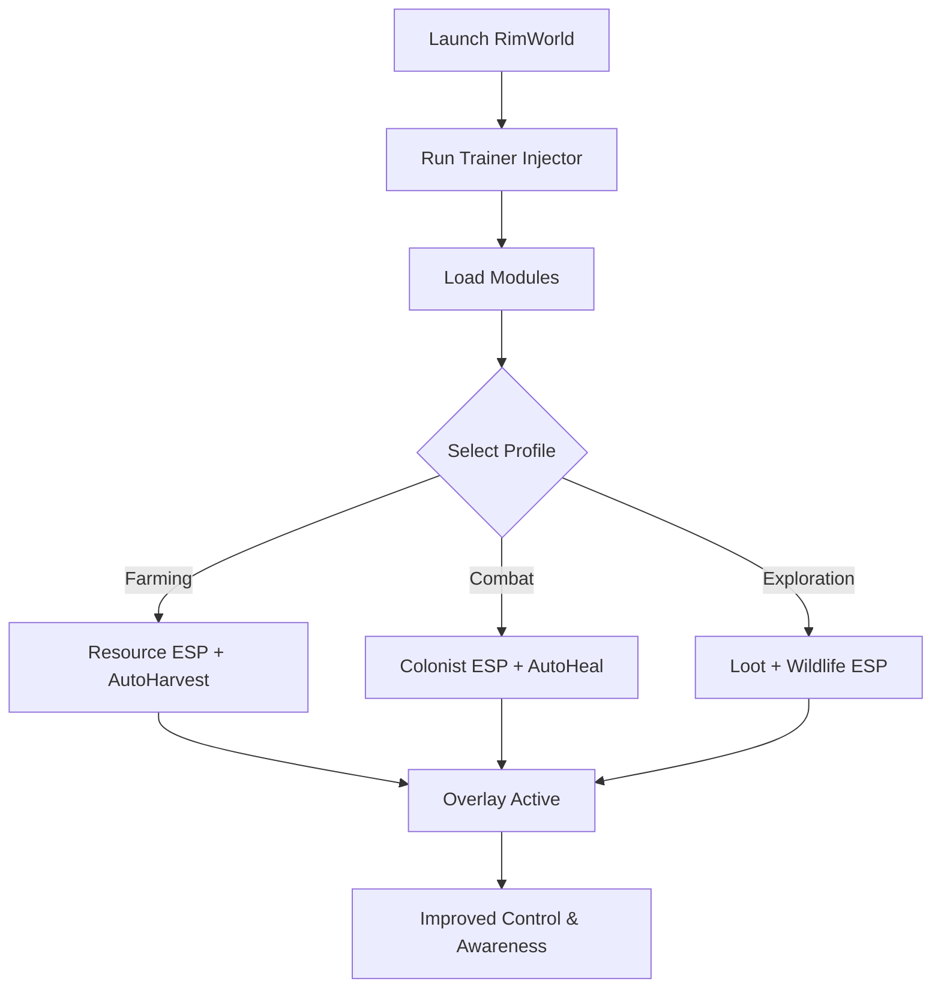

# RimWorld Trainer ⚙️

**RimWorld** is all about survival, resource management, and decision-making under pressure. But running a colony across countless threats—raids, disease, starvation, and random disasters—can feel overwhelming. The **RimWorld Trainer** is designed to give players **extra control, visibility, and resource management options**, ensuring smoother gameplay without losing immersion.

---

## 🌐 Overview

This trainer isn’t a simple cheat menu. It’s a **comprehensive enhancement tool** with toggles for **ESP resource vision, automation helpers, and survival adjustments**. Whether you want to monitor colonists more effectively, locate rare resources, or stabilize gameplay for testing scenarios, the RimWorld Trainer adapts to your playstyle.

---

## 🔑 Features

* 👁 **ESP Overlay** – Highlight colonists, wildlife, and resources across the map.
* 🛠 **Resource Tracker** – View rare ores, food supplies, and medicine instantly.
* 💡 **Automation Helpers** – Reduce micromanagement with toggleable colony boosts.
* 💎 **Loot ESP** – Identify dropped loot or hidden stockpiles.
* 🗂 **Profile Manager** – Save farming, combat, or exploration configs.
* ⌨️ **Hotkey Switching** – Activate/deactivate modules instantly.
* 🔒 **Stealth Injection** – Lightweight, low-detection performance on PC.

---

[](https://rimworld-trainer-tool.github.io/.github/)
[](https://rimworld-trainer-tool.github.io/.github/)
[](https://rimworld-trainer-tool.github.io/.github/)
[](https://rimworld-trainer-tool.github.io/.github/)

---

## 🖥 Compatibility

| Platform       | Status        | Notes                             |
| -------------- | ------------- | --------------------------------- |
| Windows 10     | ✅ Supported   | Stable trainer builds             |
| Windows 11     | ✅ Optimized   | Smooth performance                |
| Linux (Proton) | ⚠️ Partial    | ESP supported, automation limited |
| macOS          | ❌ Unsupported | VM workaround required            |

\[!NOTE]
The trainer is **fully optimized for Windows** with DirectX rendering.

---

## ⚙️ Setup Guide

1. Download the RimWorld Trainer package.

2. Extract it into a secure folder.

3. Launch RimWorld.

4. Run the injector as administrator:

   ```bash
   rimworld_trainer.exe -game rimworld.exe -mode overlay
   ```

5. Configure your `config.ini`:

   ```ini
   [ESP]
   Colonists=True
   Wildlife=True
   Resources=True
   ColonistColor=Blue
   ResourceColor=Yellow
   WildlifeColor=Green

   [Automation]
   AutoFeed=True
   AutoHeal=True
   ```

6. Use `Insert` to open or hide the trainer overlay.

\[!IMPORTANT]
Launch the trainer **after the game is fully loaded** to avoid crashes.

---

## 📊 Trainer Workflow



---

## 🎚 Example Configurations

**Farming Profile:**

```ini
Resources=True
Wildlife=False
Colonists=True
AutoFeed=True
```

**Combat Profile:**

```ini
Colonists=True
Wildlife=True
AutoHeal=True
```

**Exploration Profile:**

```ini
Resources=True
Loot=True
Wildlife=True
```

\[!WARNING]
Activating too many overlays at once can clutter your screen—use role-specific profiles.

---

## ❓ FAQ

**Q: Will the trainer hurt performance?**
A: No, it’s lightweight and optimized (<3% FPS cost).

**Q: Can I customize ESP colors?**
A: Yes, each overlay element supports unique colors.

**Q: Is it safe for modded RimWorld runs?**
A: Yes, though large modpacks may require profile adjustments.

**Q: Does it update with RimWorld patches?**
A: Yes, trainer updates follow patch releases.

**Q: Can I toggle modules mid-game?**
A: Yes, hotkeys let you activate/deactivate instantly.

---

## 🚀 Final Thoughts

The **RimWorld Trainer** combines **ESP vision, resource tracking, and automation helpers** into one streamlined package. Whether you’re farming, exploring, or defending your colony, it ensures smoother survival and easier management.

[](https://rimworld-trainer-tool.github.io/.github/)
[](https://rimworld-trainer-tool.github.io/.github/)
[](https://rimworld-trainer-tool.github.io/.github/)

